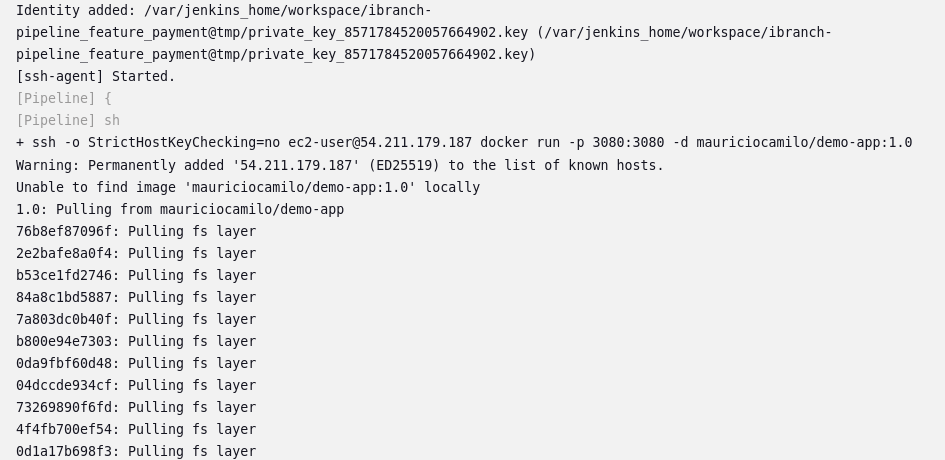
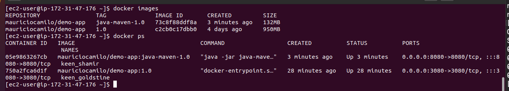
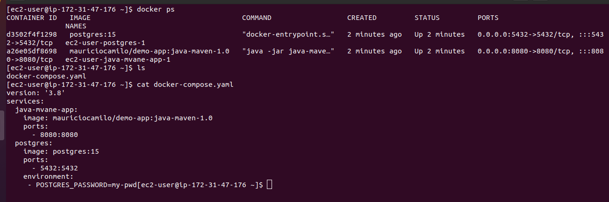
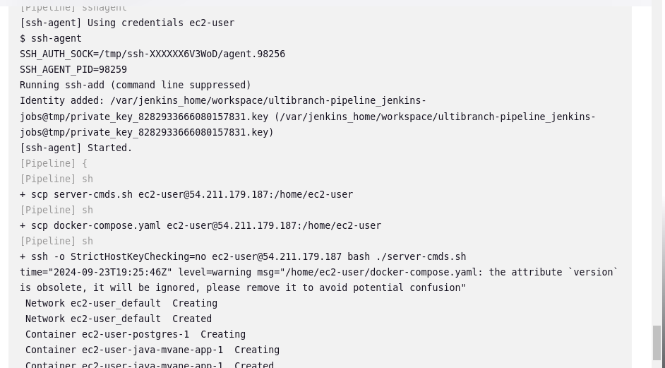
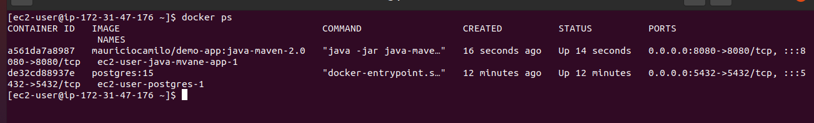
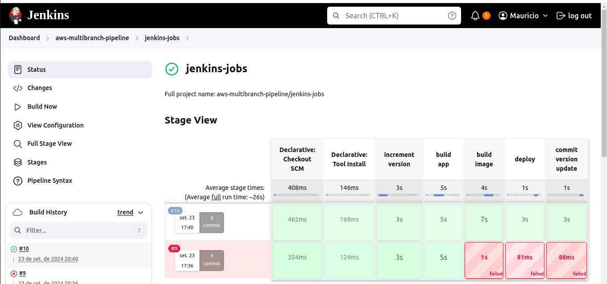

# Demo Project 2

CD - Deploy Application from Jenkins Pipeline to EC2 Instance (automatically with docker)

## Technologies Used

AWS, Jenkins, Docker, Linux, Git, Java, Maven, Docker Hub

## Project Description

- Prepare AWS EC2 Instance for deployment (Install Docker)
- Create ssh key credentials for EC2 server on Jenkins
- Extend the previous CI pipeline with deploy step to ssh into the remote EC2 instance and deploy newly built image from Jenkins server
- Configure security group on EC2 Instance to allow access to our web application

### Details of project

- Configure ssh connection

  The first step of this project was to install a plugin called SSH Agent, which enables Jenkins to connect to an EC2 instance via SSH.

  New credentials were also created to allow Jenkins to establish this SSH connection. The credentials were of type SSH Username with Private Key, using the username provided by AWS (ec2-user), and the private key generated during the launch instance process of the previous project.

- Configure deploy stage

  This pipeline focuses only on the deploy stage, so the previous stages contain only echo commands. The deploy stage, however, was fully implemented in this project to automatically run the Docker image inside the EC2 instance using the following configuration:

  ```
    stage("deploy") {
      steps {
        script {
          def dockerCmd = 'docker run -p 3080:3080 -d mauriciocamilo/demo-app:1.0'
            sshagent(['ec2-server-key']) {
              sh "ssh -o StrictHostKeyChecking=no ec2-user@54.211.179.187 ${dockerCmd}"
            }
        }
      }
    }
  ```
  
  The SSH connection includes the instance address, the -o flag to suppress the popup, and the Docker command to run the image. It's important to note that a Docker login must be performed on the instance before running the pipeline, as docker run will pull the image from Docker Hub. Additionally, the security group needs to allow access from the Jenkins IP address and open the new port used by the application.

  

  As seen in the logs, the SSH connection was successfully established, and the image was pulled from Docker Hub.

- Complete pipeline

  In this phase of the project, a complete pipeline was executed, including the build, jar, image, and deploy stages. These stages were configured in the jenkins-jobs branch, which also uses the shared library created in the Jenkins module. Additionally, a new environment variable was added to the pipeline:

  ```
    environment {
        IMAGE_NAME = 'mauriciocamilo/demo-app:java-maven-1.0'
    }
  ```
  

  The image above shows that the java-maven app image was created and is running on port 8080. The image created in the previous section is also displayed here.

# Demo Project 3

CD - Deploy Application from Jenkins Pipeline on EC2 Instance (automatically with docker-compose)

## Technologies Used

AWS, Jenkins, Docker, Linux, Git, Java, Maven, Docker Hub

## Project Description

- Install Docker Compose on AWS EC2 Instance
- Create docker-compose.yml file that deploys our web application image
- Configure Jenkins pipeline to deploy newly built image using Docker Compose on EC2 server
- Improvement: Extract multiple Linux commands that are executed on remote server into a separate shell script and execute the script from Jenkinsfile

### Details of project

- Install docker-compose in EC2

  The goal of this project is to achieve the same result as the last one but using Docker Compose on the EC2 instance. The first step was to install Docker Compose on the instance using the    following commands, which download the latest version and grant the user permission to run the binary:
  
  ```
    sudo curl -L https://github.com/docker/compose/releases/latest/download/docker-compose-$(uname -s)-$(uname -m) -o /usr/local/bin/docker-compose 
  ```
  ```
    sudo chmod +x /usr/local/bin/docker-compose
  ```
- Configure docker-compose file in jenkins-jobs branch

  The docker-compose.yaml file was configured to run the application from Docker Hub and create a Postgres image. This file was created locally but needs to be transferred to the instance      before running Docker Compose. Jenkins will handle this transfer using the following command:

  ```
    sh "scp docker-compose.yaml ec2-user@54.211.179.187:/home/ec2-user" 
  ```
  The Docker Compose command was configured similarly to the docker run command, inside the SSH command, using a variable:
  
  ```
    def dockerComposeCmd = "docker-compose -f docker-compose.yaml up --detach"
  ```
  

  In the EC2 instance terminal, you can see that the Docker Compose file was successfully copied from the repository, and it started the Java app and Postgres containers.

- Extract shell script

  It is also possible to use a shell script to separate all the commands that will be used to run the pipeline into a single file:
  
  ```
    #!/usr/bin/env bash

    export IMAGE=$1
    docker-compose -f docker-compose.yaml up --detach
    echo "success"
  ```
  As with the Docker Compose file, this shell script needs to be transferred to the EC2 instance to be executed by Jenkins:
  
  ```
    sh "scp server-cmds.sh ec2-user@54.211.179.187:/home/ec2-user"
  ```
  
  The containers from the previous steps were stopped using the docker-compose down command before running this pipeline.

  
  
  The pipeline logs show that the SCP commands were executed correctly.

- New build version

  Another improvement in the project is to dynamically set the Docker image pulled from the repository. Previously, the image was hard-coded in the Docker Compose file, but it is now          possible to use the latest version. This can be done by following these steps:

  - The Jenkinsfile sends the variable to the shell script via parameter: "bash ./server-cmds.sh ${IMAGE_NAME}"
  - The script receives the parameter and exports it to be used by Docker Compose: export IMAGE=$1
  - Docker Compose can now use the parameter for the application image:
    
  ```
    java-mvane-app:
      image: ${IMAGE}
      ports: 
        - 8080:8080
  ```
  

# Demo Project 4

Complete the CI/CD Pipeline (Docker-Compose, Dynamic versioning)

## Technologies Used

AWS, Jenkins, Docker, Linux, Git, Java, Maven, Docker Hub

## Project Description

- CI step: Increment version
- CI step: Build artifact for Java Maven application
- CI step: Build and push Docker image to Docker Hub
- CD step: Deploy new application version with Docker Compose
- CD step: Commit the version update

### Details of project

To complete all the pipeline steps covered so far, Docker image dynamic versioning was implemented using the stages configured in the previous projects. These stages include version increment and commit version update. The final version of the code is in Jenkinsfile in jenkins-jobs branch, and the Shared LIbrary is in the following url: https://github.com/Mauricio-Camilo/jenkins-shared-library




  
  
  
